<div align="center">



<br><br>

[](https://linkedin.com/in/sharvinneve)
[](https://github.com/Guts1005)
[](mailto:sharvinneve67@gmail.com)
[](Sharvin_Neve_CV.pdf)

<br>

```bash
sharvin@edge-node:~$ neofetch --profile
  OS        :: Linux 6.x (Edge Fleet Architecture / 6-Node Distributed Cluster)
  Host      :: NMIMS MPSTME, Mumbai (Integrated B.Tech + MBA Tech '28)
  Kernel    :: Modern C++20, Python 3.12, POSIX Threads, WebRTC
  Upstream  :: SGLang, vLLM / FlashAttention, fe2o3 (Linux memfd sealing)
  Roles     :: Software & Systems Intern @ Aspire Consultancy | Ex-Entice Engineering
  Focus     :: Distributed LLM Inference, KV Cache Scheduling, Low-Latency Edge Telemetry
  Ethos     :: "If it doesn't survive network partitions and high I/O concurrency, it isn't ready for production."
```

</div>

---

### // 01. Executive Profile & Systems Philosophy

I am a computer engineering student and systems software engineer building at the intersection of **low-level systems** and **applied AI infrastructure**.

Rather than stopping at high-level API abstractions, I engineer deep in the stack: instrumenting latency telemetry upstream in tier-1 LLM inference engines (**SGLang**, **vLLM / FlashAttention**), developing memory-constrained C++ daemons for multi-node edge camera fleets, and shipping production predictive ML systems. My engineering focus is bounded latency, deterministic resource usage, and zero-downtime reliability under heavy concurrency.

---

### // 02. Upstream AI & Systems Engineering (The 0.1% Signal Layer)

Direct contributions and patches to production AI inference frameworks and foundational Linux infrastructure:

| Project | Pull Request / Patch | Architectural Scope & Impact |
| :--- | :--- | :--- |
| **[sgl-project/sglang](https://github.com/sgl-project/sglang)** | [`PR #38228`](https://github.com/sgl-project/sglang/pull/38228) | **Distributed LLM Inference**: Instrumented Prometheus latency telemetry across distributed streaming queues for high-throughput inference monitoring. |
| **[vllm-project/flash-attention](https://github.com/vllm-project/flash-attention)** | [`PR #194`](https://github.com/vllm-project/flash-attention/pull/194) | **GPU Acceleration**: Hoisted preprocessor directives from macro expansions for MSVC compiler conformance on NVIDIA Hopper architectures. |
| **[harsh-nod/fe2o3](https://github.com/harsh-nod/fe2o3)** | [`PR #273`](https://github.com/harsh-nod/fe2o3/pull/273) | **Linux Systems**: Hardened Linux `memfd_create` file sealing against bounded `EBUSY` collision windows under heavy concurrent process forks. |
| **[Guts1005/gmail-oauth-mailer](https://github.com/Guts1005/gmail-oauth-mailer)** | [Repository](https://github.com/Guts1005/gmail-oauth-mailer) | **Developer Tooling**: Diagnosed and resolved async socket timeout race conditions in automated CI test harnesses; designed for modular npm packaging. |

---

### // 03. Production Systems & Industry Experience

#### **Software & Systems Engineering Intern** — *Aspire Consultancy Services*
*(May 2026 – July 2026)*
- **Distributed Edge Telemetry**: Architected an offline-first distributed telemetry and video data pipeline across a 6-node edge fleet, reliably ingesting **18GB of multimodal footage** and **14,750+ telemetry events** across intermittent network partitions.
- **Low-Footprint C++ Daemon**: Engineered an edge supervisor daemon in C++ with a **<45MB RAM footprint** and `systemd` watchdog supervision, achieving zero crash-loops and continuous automated cloud re-synchronization.
- **Sub-300ms Live Streaming**: Integrated WebRTC streaming (LiveKit + FFmpeg + Next.js) and multimodal API ingestion for automated real-time inspection, dual-track recording (local & desktop), and AI snapshot comparison.

#### **Systems Software Intern** — *Entice Engineering*
*(Aug 2025 – Dec 2025)*
- **High-Throughput Serialization**: Built event serialization routines in C and Python, hitting **sub-5ms data acquisition latency** under sustained high-I/O sensor throughput.
- **Hardware Integration**: Developed automated hardware integration and telemetry synchronization pipelines deployed across production sensor systems.

---

### // 04. Flagship Architectures & Repositories

#### 1. **[Smart Helmet Live (`Streaming-Rpi`)](https://github.com/Guts1005/Streaming-Rpi)** — Industrial Edge Streaming & AI Safety System
*Industrial-grade edge streaming, BLE beacon worker tracking, and Google Gemini AI safety platform for Raspberry Pi.*

- **Sub-300ms Low-Latency Streaming**: Hardware-encoded H.264 video ingested into Simple Realtime Server (SRS) and delivered via HTTP-FLV (`mpegts.js`) with two-way WebRTC audio talkback to the Next.js control center.
- **Offline-First & Auto-Chunking**: GPIO button triggers 5-minute segmented recording (`ffmpeg`) with automated sequential cloud synchronization and headless camera-based QR Wi-Fi provisioning.
- **Zero-Trust Security & SQA**: Enforces zero open inbound ports via Cloudflare Tunnels, strict Content-Security-Policy (CSP), tenant device isolation, and automated **GitHub CodeQL AST** and **Gitleaks** quality gates.

[](https://github.com/Guts1005/Streaming-Rpi/actions/workflows/ci.yml)
[](https://github.com/Guts1005/Streaming-Rpi/actions/workflows/codeql.yml)
[](https://raspberrypi.org)
[](https://github.com/ossrs/srs)
[](https://nextjs.org/)
[](https://ai.google.dev/)

🔗 **[Explore Streaming-Rpi Repo](https://github.com/Guts1005/Streaming-Rpi)** · **[v1.0.0 Release](https://github.com/Guts1005/Streaming-Rpi/releases/tag/v1.0.0)** · **[Centrix Helmet Docs](https://github.com/Guts1005/Centrix-Helmet)**

---

#### 2. **[ChurnIQ](https://github.com/Guts1005/ChurnIQ)** — Predictive Analytics & ML Pipeline Platform
*Production-grade machine learning platform for customer churn analytics with automated feature transformation and real-time scoring.*

- **Calibrated Ensemble Model**: Engineered an end-to-end predictive pipeline analyzing high-dimensional user interaction data, achieving an **84.93% ROC-AUC** with calibrated XGBoost and LightGBM models.
- **Full-Stack Architecture**: Built a high-concurrency FastAPI backend with interactive React & Streamlit evaluation dashboards for lead triage and feature importance visualizers.


---

<details>
<summary><strong>❯ View Additional Systems & Tooling Projects</strong></summary>

<br>

#### **ShiftLeft Testing Dashboard**
*AI-augmented developer tooling & automated defect prediction.*
- Integrates Google Gemini API to analyze automated continuous integration test runs, predict recurring defect hotspots, and generate actionable telemetry for engineering teams.
- **Stack:** Python, Google Gemini API, React, Node.js.

#### **Gmail OAuth Mailer**
*Reusable, production-hardened OAuth 2.0 mail dispatch engine.*
- Abstracted complex Google OAuth 2.0 authentication flows into an npm-ready library. Hardened against asynchronous socket timeout race conditions under high-throughput queues.
- **Stack:** Node.js, OAuth 2.0, Mocha/Chai.

</details>

---

### // 05. Technical Stack & Ecosystem

<div align="center">


<br><br>

| Domain | Core Technologies & Tooling |
| :--- | :--- |
| **Systems & Languages** | `C++17/20` · `C (C99/C11)` · `Python` · `TypeScript` · `JavaScript` · `SQL` · `Bash` · `Rust (Foundations)` |
| **AI Systems & LLM Infra** | `SGLang` · `vLLM` · `FlashAttention` · `PyTorch` · `Scikit-learn` · `LangChain` · `LlamaIndex` · `Prometheus` |
| **Backend & Distributed** | `FastAPI` · `Next.js` · `Node.js` · `React` · `WebRTC / LiveKit` · `WebSockets` · `Docker` · `Redis` · `PostgreSQL` |
| **Edge, Cloud & Security** | `Raspberry Pi` · `Linux Kernel (systemd/POSIX)` · `FFmpeg` · `AWS Cloud Practitioner` · `GitHub Actions` · `CodeQL` · `Gitleaks` |

</div>

---

### // 06. Active Research & Architectural Horizons

- **Distributed KV Cache & Memory Scheduling**: Exploring PagedAttention memory layouts and chunked prefill dynamics across distributed inference instances (vLLM / SGLang).
- **Agentic Workflows via Model Context Protocol (MCP)**: Building multi-agent systems with deterministic tool routing, dynamic context pruning, and sandboxed execution boundaries.
- **Kernel-Level Observability**: Writing eBPF probes for zero-overhead telemetry tracking on edge Linux daemons and low-latency network sockets.

---

### // 07. Honors, Credentials & Hackathons

- 🥇 **Smart India Hackathon (SIH)** — *National Finalist (Hardware & Systems Software Track)*
- ☁️ **AWS Cloud Quest: Cloud Practitioner** — *Verified Cloud Architecture Credential*
- 📜 **NPTEL Elite Certificate** — *Design Practices for Intelligent Product Design (IIT Kanpur)*
- 🎸 **Musician & Band Member** — *Practicing creative discipline, live rhythm, and team dynamics*

---

### // 08. GitHub Telemetry & Velocity

<div align="center">
  <a href="https://github.com/Guts1005">
    
  </a>
  <a href="https://github.com/Guts1005">
    
  </a>
</div>

<div align="center">
  <a href="https://github.com/Guts1005">
    
  </a>
</div>

---

### // 09. Let's Build Something High-Impact.

<div align="center">

Whether you're working on distributed AI inference engines, edge systems, or ambitious infrastructure challenges — my inbox is always open.

[](https://linkedin.com/in/sharvinneve)
[](mailto:sharvinneve67@gmail.com)
[](https://github.com/Guts1005)

</div>
